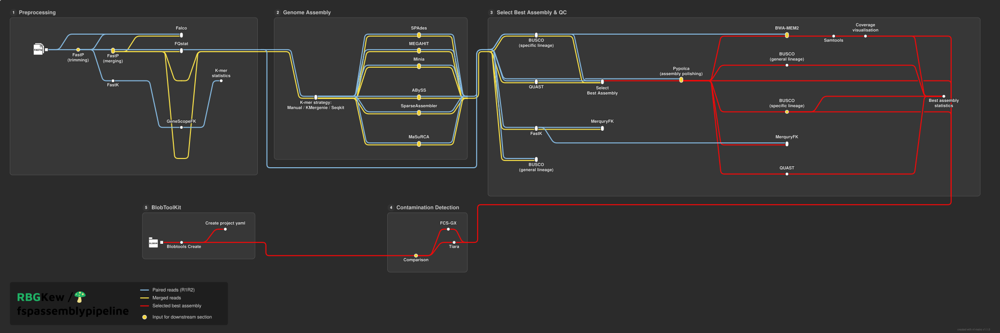

<h1>
  <picture>
    <source media="(prefers-color-scheme: dark)" srcset="docs/images/rbgkew-fspassemblypipeline_logo_dark.png">
    
  </picture>
</h1>

[](https://github.com/codespaces/new/nf-core/fspassemblypipeline)
[](https://github.com/nf-core/fspassemblypipeline/actions/workflows/nf-test.yml)
[](https://github.com/nf-core/fspassemblypipeline/actions/workflows/linting.yml)[](https://nf-co.re/fspassemblypipeline/results)[](https://doi.org/10.5281/zenodo.XXXXXXX)
[](https://www.nf-test.com)

[](https://www.nextflow.io/)
[](https://github.com/nf-core/tools/releases/tag/4.1.0)
[](https://docs.conda.io/en/latest/)
[](https://www.docker.com/)
[](https://sylabs.io/docs/)
[](https://cloud.seqera.io/launch?pipeline=https://github.com/nf-core/fspassemblypipeline)

[](https://nfcore.slack.com/channels/fspassemblypipeline)[](https://bsky.app/profile/nf-co.re)[](https://mstdn.science/@nf_core)[](https://www.youtube.com/c/nf-core)

## Introduction

**RBGKew/fspassemblypipeline** is a comprehensive bioinformatics pipeline designed for genome assembly from Illumina short-read sequencing data. The pipeline ingests raw paired-end reads and performs quality control, read preprocessing (trimming, merging, removing clean reads less than 30bp and deduplication), k-mer profiling (sequencing depth and genome size estimation), de novo genome assembly (with multiple assembler and multiple k-mer strategy options), genome assembly quality assessment (completeness, contiguity, accuracy), benchmarking of the assemblies based on the quality and selction of the best one, and contamination detection. It is designed to handle challenging samples such as those with degraded DNA from fungal herbarium specimens, as implemented for the Fungarium Sequencing Project at Royal Botanic Gardens, Kew (https://www.kew.org/science/our-science/projects/sequencing-kews-fungarium), but it can be used for any paired-end Illumina data.




> In case the image above doesn't load, please have a look at the [static version](docs/images/fsppipeline_metro.svg).

## Pipeline steps

1. Read QC ([`Falco`](https://github.com/smithlabcode/falco), Read preprocessing ([`fastp`](https://github.com/OpenGene/fastp) short reads trimming and merging), K-mer counting ([`FASTK`](https://github.com/thegenemyers/FASTK) and k-mer profiling [`genescopeFK`](https://github.com/thegenemyers/GENESCOPE.FK))
2. Genome assembly ([`SPAdes`](https://github.com/ablab/spades), [`MEGAHIT`](https://github.com/voutcn/megahit), [`Minia`](https://github.com/GATB/minia), [`ABySS`](https://github.com/bcgsc/abyss), [`SparseAssembler`](https://github.com/yechengxi/SparseAssembler)) and [MaSuRCA](https://github.com/alekseyzimin/masurca/tree/master)
3. Assembly assessment ([`BUSCO`](https://busco.ezlab.org/), [`QUAST`](http://quast.sourceforge.net/), [`MerquryFK`](https://github.com/thegenemyers/MerquryFK), selection of the best assembly, polishing of the selected assembly and final QC for polished assembly
4. Contamination detection ([`Tiara`](https://github.com/ibe-uw/tiara),[`FCS-GX`](https://github.com/ncbi/fcs-gx))
5. Creation of blobtools directory ready for contamination removal ([`BlobTools`](https://github.com/drl/blobtools))

### Preprocessing

The preprocessing subworkflow is implemented in `subworkflows/local/preprocessing/main.nf`.
It performs raw read QC, adapter trimming, read merging, QC compilation, and k-mer profiling before downstream assembly and analysis.

The preprocessing subworkflow runs the following steps:

- `FALCO` raw read QC
- `fastp` trimming/filtering while keeping complete trimmed R1/R2 output
- `fastp` merge of trimmed reads with merged and unmerged outputs
- `FALCO` QC on trimmed and merged reads
- Falco QC statistics compilation across raw, trimmed, and merged stages
- `FQSTAT` read statistics and summary report generation
- `FASTK` k-mer histogram generation
- `GENESCOPEFK` k-mer profile summarization
- final k-mer summary table generation

### Genome assembly

The genome assembly part of the pipeline is divided in three subworkflows:

1. `subworkflows/local/genome_assembly/main.nf`, where paired end reads are processed by the assemblers
2. `subworkflows/local/genome_assembly_merged/main.nf`, where merged reads are processed by the assemblers
3. `subworkflows/local/select_best_assembly_and_qc/main.nf`, where the draft assemblies are quality assessed, the best one is selected for polishing and is quality assessed again.

Each sample is assembled using the following assemblers:

- [SPAdes](https://github.com/ablab/spades) - multi k-mer assembler
- [MEGAHIT](https://github.com/voutcn/megahit) - multi k-mer assembler
- [AbySS](https://github.com/bcgsc/abyss) - single k-mer assembler
- [SparseAssembler](https://github.com/yechengxi/SparseAssembler) - single k-mer assembler
- [Minia](https://github.com/GATB/minia?tab=readme-ov-file) - single k-mer assembler
- [MaSuRCA](https://github.com/alekseyzimin/masurca/tree/master) - single k-mer assembler

The user can choose which assemblers to use by selecting them through the [`nextflow.config`](nextflow.config). More information about how to set up the `nextflow.config` can be found in [`docs/usage.md`](docs/usage.md).

The user can choose between three different strategies to set the k-mer size for the genome assembly process:

1. `manual`: the k-mer size is set manually for each assembler in the [config.yml](config/config.yml).
2. `kmergenie`: [KMerGenie](https://github.com/movingpictures83/KMerGenie) is used to estimate the best k-mer size for genome assembly for each library. Note that KMerGenie should be used with haploid or diploid genomes only.
3. `reads_length`: [SeqKit](https://bioinf.shenwei.me/seqkit/) is used to calculate the median reads length and the k-mer size is set to be 2/3rds of the median.

The user can choose which k-mer strategues to use by selecting them through the [`nextflow.config`](nextflow.config). More information about how to set up the `nextflow.config` can be found in [`docs/usage.md`](docs/usage.md).

Furthermore, the user can choose to use two different input reads:

1. forward and reverse reads files
2. merged reads

The user can choose which reads type to use by selecting them through the [`nextflow.config`](nextflow.config). More information about how to set up the `nextflow.config` can be found in [`docs/usage.md`](docs/usage.md).

> [!NOTE]
> **If the user wishes to use merged reads, running the pre-processing step is mandatory.**

The assemblies produced by each assembler for each sample using different settings are then quality inspected with the following tools:

- [BUSCO](https://busco.ezlab.org/busco_userguide.html) - evaluates each produced assembly quality in terms of expected gene content. It is run twice for each sample, once using a general dataset, and once using a more closely related dataset. See [`config/README.md`](config/README.md) for more details.
- [QUAST](https://quast.sourceforge.net/docs/manual.html) - computes assembly statistics.
- [MerquryFK](https://github.com/thegenemyers/MERQURY.FK) - computes k-mer analysis for each assembly and compares its content with the k-mer computed for raw reads by [FastK](https://github.com/thegenemyers/FASTK).

The best assembly for each sample is then selected. The selection is based on the highest complete and single BUSCO content (absolute number, not percentage), using the taxonomically closest busco lineage to the sample's species. If more than one assembly have the highest complete and single copy BUSCO score, the assembly with the highest aUN (calculated by QUAST) among those is selected.

The best assembly is then handed over to [pypolca](https://github.com/gbouras13/pypolca), to improve the assembly by performing substitution, insertion, and deletion errors correction.

The improved best assembly is then quality assessed again with BUSCO, QUAST, and MerquryFK, and aligned back to the reads with [bwa-mem2](https://github.com/bwa-mem2/bwa-mem2) and [samtools](https://github.com/samtools/samtools), which is also used to analyse the genome coverage.

A standalone implementation in Snakemake of this part of the pipeline is available at https://github.com/LiaOb21/FSP_assembly_benchmarking.

### Contamination detection

The contamination detection part of the pipeline is divided in two subworkflows:

1. `subworkflows/local/contamination_detection/main.nf`, which runs FCS-GX and Tiara for taxanomic labelling of contigs and scaffolds and reformats the FCS-GX output for processing
2. `subworkflows/local/blobtools/main.nf`, which creates a yaml file for each sample and produces a blob directory ready for decontamination

The contamination detection subworkflow runs the following steps:

- `Tiara` assigns domain level taxonomy and organelle/motrochondrial DNA labels to contigs.
- `FCS-GX` Assigns species level taxonomy to contigs.
- `convertrpt` Reformats output of FCS-GX for downstream processing.
- `Comparison` Compares the domain level assignments of Tiara & FCS-GX and uses this to create labels for the final blobplot.

The blobtools subworkflow takes the taxonomic labels created in the contamination_detection subworkflow and the GC content and coverage information and
plots this on a graph allowing for visualisation of contamination. It runs the following steps:

- `Create_yaml` Creates a yaml file from the samplesheet to generate the blobplot.
- `SAMTOOLS_CSI` Indexes the .bam files to produce .bam.csi files as required by blobtools.
- `blobtoolkit_create` Creates the blobdir from the output of contamination detection and the provided samplesheet.

## Usage

> [!NOTE]
> If you are new to Nextflow and nf-core, please refer to [this page](https://nf-co.re/docs/get_started/environment_setup/overview) on how to set-up Nextflow. Make sure to [test your setup](https://nf-co.re/docs/get_started/run-your-first-pipeline) with `-profile test` before running the workflow on actual data.

### Required inputs

#### Samplesheet

First, prepare a samplesheet with your input data. The samplesheet for a full run of the pipeline looks as follows:

```csv
sample,file_1,file_2,type,fasta,taxid,family,order,class,phylum
sample_1,/path/to/sample_1_R1.fastq.gz,sample_1_R2.fastq.gz,raw,,<TAXID>,<FAM>,<ORD>,<CLA>,<PHY>
sample_2,/path/to/sample_2_R1.fastq.gz,sample_2_R2.fastq.gz,raw,,,<TAXID>,<FAM>,<ORD>,<CLA>,<PHY>
```

Each row represents a pair of fastq files (paired end), with the associated metadata (taxid and taxonomy). An example can be found [here](assets/samplesheet.csv).

The samplesheet can also be set up in order to run only a specific subworkflow. This can be achieved as follows:

> [!NOTE]
> If you wish to run preprocessing only or genome assembly only it is mandatory to set `use_merged_reads = false` in `nextflow.config`

1. Preprocessing only

This setting allows to use the pipeline to only perform the preprocessing of the raw illumina reads. It runs the `subworkflows/local/preprocessing/main.nf`.

```csv
sample,file_1,file_2,type,fasta,taxid
sample_1,/path/to/sample_1_R1.fastq.gz,sample_1_R2.fastq.gz,raw,,
sample_2,/path/to/sample_2_R1.fastq.gz,sample_2_R2.fastq.gz,raw,,
```

An example can be found [here](assets/samplesheet_preprocessing.csv).

2. Genome assembly only

This setting allows to use the pipeline to only perform the assembly of preprocessed paired-end illumina reads. It runs the `subworkflows/local/genome_assembly/main.nf`.

> [!NOTE]
> To run this subworkflow the taxonomy _must_ be provided. However, if you don't have a defined taxonomy for each sample, you can run it anyway by using a place order like "NA" to replace the taxonomic ranks. This means that busco will only run with the lineage provided in the `nextflow.config`

```csv
sample,file_1,file_2,type,fasta,taxid,family,order,class,phylum
sample_1,/path/to/sample_1_R1.clean.fastq.gz,sample_1_R2.clean.fastq.gz,cleaned,,,<FAM>,<ORD>,<CLA>,<PHY>
sample_2,/path/to/sample_2_R1.clean.fastq.gz,sample_2_R2.clean.fastq.gz,cleaned,cleaned,,,<FAM>,<ORD>,<CLA>,<PHY>
```

An example can be found [here](assets/samplesheet_assembly.csv).

3. Contamination detection only

> [!NOTE]
> Fasta files must be gzipped.

```csv
sample,file_1,file_2,type,fasta,busco,taxid
sample_1,/path/to/sample_1.bam,,bam,/path/to/sample_1.fasta.gz,/path/to/sample_1/busco/full_table.tsv,<TAXID>
sample_2,/path/to/sample_2.bam,,bam,/path/to/sample_2.fasta.gz,/path/to/sample_2/busco/full_table.tsv<TAXID>
```

An example can be found [here](assets/samplesheet_contamination_detection.csv).

4. Preprocessing and assembly

> [!NOTE]
> The constraint about the taxonomy mentioned above for genome assembly only applies here too.

```
sample,file_1,file_2,type,fasta,taxid,family,order,class,phylum
sample_1,/path/to/sample_1_R1.fastq.gz,sample_1_R2.fastq.gz,raw,,,<FAM>,<ORD>,<CLA>,<PHY>
sample_2,/path/to/sample_2_R1.fastq.gz,sample_2_R2.fastq.gz,raw,,,<FAM>,<ORD>,<CLA>,<PHY>
```

An example can be found [here](assets/samplesheet_preprocessing_and_assembly.csv).

#### Pre-dowloaded BUSCO lineages

To run BUSCO using a lineage closely related to each of the samples, we need to input a list of available busco lineages, and to download them beforehand. This can be achieved as follows:

```
cd to/where/you/want/to/store/busco/databases

conda activate busco

busco --list > busco_lineages.txt

gawk '/fungi_odb12/{flag=1; indent=length($0)-length(ltrim($0)); print "fungi_odb12"; next}
     flag && /- [a-z_]*_odb12/ {
         current_indent=length($0)-length(ltrim($0))
         if(current_indent <= indent) flag=0
         else print gensub(/.*- ([a-z_]*_odb12).*/, "\\1", "g")
     }
     function ltrim(s) { sub(/^[ \t\r\n]+/, "", s); return s }' busco_lineages.txt > fungi_busco_lineages.txt
```

In the example above we are extracting the names of all the BUSCO lineages that belong to the fungi kingdom. The target group can be different and its taxonomic level doesn't matter. The user can for example target `eukaryota` or something more specific like `basidiomycota` using the same code. Note that `odb12` extension refers to a specific version of BUSCO lineages, and it can be changed when newer versions will be available.

`fungi_busco_lineages.txt` and the extension must to be provided through the `nextflow.config`:

```
    busco_db_extension         = 'odb12'
    lineages_list_file         = 'path/to/fungi_busco_lineages.txt'
```

Using the list of lineages of interest we can then easily download all of them in one go:

```
for i in $(cat fungi_busco_lineages.txt); do
  echo "downloading $i database"
  busco --download_path . --download $i
done
```

This speeds up the pipeline as it will not have to download busco lineages on the fly, and will avoid connection problems during the run.

We also need to provide the path to where busco lineages are downloaded in `nextflow.config`:

```
    busco_lineages_path        = 'path/to/lineages/parent/directory'
```

Note that BUSCO automatically downloads lineages in a directory called `lineages`. In `nextflow.config` we need to provide the path to the parent directory of `lineages`. This needs to be the full absolute path.

#### FCS-GX database

The FCS-GX database is required for the contamination detection. The user should install FCS-GX to be able to proceed. It can be installed via conda:

```
conda create -n fcsgx ncbi-fcs-gx
conda activate fcsgx
```

For a real run, the full database is required and can be downloaded in the following way:

```
mkdir gxdb
cd gxdb
sync_files.py get --mft https://ftp.ncbi.nlm.nih.gov/genomes/TOOLS/FCS/database/latest/all.manifest --dir ./gxdb
```

Note that the full database requires a substantial amount of space.

For a test run, we recommend using the test database. It can be downloaded as follows:

```
mkdir -p data/gxdb
cd data/gxdb/
sync_files.py get --mft https://ftp.ncbi.nlm.nih.gov/genomes/TOOLS/FCS/database/test-only/test-only.manifest --dir ./test-only
```

### Run the pipeline

Now, you can run the pipeline using:

```bash
nextflow run RBGKew/fspassemblypipeline \
   -profile <docker/singularity/.../institute> \
   --input <SAMPLESHEET> \
   --outdir <OUTDIR>
```

Below you will find the commands to run a test with the provided test data and samplesheets.

#### Full run

> [!NOTE]
> For testing purposes with the provided samplesheet we reccommend setting `skip_abyss = true`, `skip_sparseassembler = true` and `skip_masurca = true`, as these assembler fail with the test data provided.

```
nextflow run . -profile test,docker \
    --input assets/samplesheet.csv \
    --outdir <OUTDIR>
```

This test runs in approximately 31 minutes using the test profile.

#### Preprocessing only

> [!NOTE]
> It is mandatory to set `use_merged_reads = false` in `nextflow.config`

```
nextflow run . -profile test,docker \
    --input assets/samplesheet_preprocessing.csv \
    --outdir <OUTDIR>
```

This test runs in seconds using the test profile.

#### Genome assembly only

> [!NOTE]
> It is mandatory to set `use_merged_reads = false` in `nextflow.config`. Also, for testing purposes with the provided samplesheet we reccommend setting `skip_sparseassembler = true` and `skip_masurca = true`, as these two assembler fail with the test data provided.

```
nextflow run . -profile test,docker \
    --input assets/samplesheet_assembly.csv \
    --outdir <OUTDIR>
```

This test runs in approximately 22 minutes using the test profile.

#### Contamination detection only

```
nextflow run . -profile test,docker \
    --input assets/samplesheet_contamination_detection.csv \
    --outdir <OUTDIR>
```

This test runs in few minutes using the test profile.

#### Preprocessing and genome assembly

> [!NOTE]
> For testing purposes with the provided samplesheet we reccommend setting `skip_abyss = true`, `skip_sparseassembler = true` and `skip_masurca = true`, as these assembler fail with the test data provided. As preprocessing and genome assembly are executed together, in this case merge reads can be enabled in `nextflow.config`

```
nextflow run . -profile test,docker \
    --input assets/samplesheet_preprocessing_and_assembly.csv \
    --outdir <OUTDIR>
```

This test requires around 29 minutes to run using the test profile.

#### contamination detection only

> [!WARNING]
> Please provide pipeline parameters via the CLI or Nextflow `-params-file` option. Custom config files including those provided by the `-c` Nextflow option can be used to provide any configuration _**except for parameters**_; see [docs](https://nf-co.re/docs/running/run-pipelines#using-parameter-files).

## Pipeline output

To see the results of an example test run with a full size dataset refer to the [results](https://nf-co.re/fspassemblypipeline/results) tab on the nf-core website pipeline page.
For more details about the output files and reports, please refer to the
[output documentation](https://nf-co.re/fspassemblypipeline/output).

## Credits

RBGKew/fspassemblypipeline was originally written by Lia Obinu, Niall Garvey, Chris Wyatt, Fernando Duarte Frutos, Wu Huang.

We thank the following people for their extensive assistance in the development of this pipeline:

<!-- ## Contributions and Support

If you would like to contribute to this pipeline, please see the [contributing guidelines](docs/CONTRIBUTING.md).

For further information or help, don't hesitate to get in touch on the [Slack `#fspassemblypipeline` channel](https://nfcore.slack.com/channels/fspassemblypipeline) (you can join with [this invite](https://nf-co.re/join/slack)).  -->

## Citations

<!-- TODO nf-core: Add citation for pipeline after first release. Uncomment lines below and update Zenodo doi and badge at the top of this file. -->
<!-- If you use nf-core/fspassemblypipeline for your analysis, please cite it using the following doi: [10.5281/zenodo.XXXXXX](https://doi.org/10.5281/zenodo.XXXXXX) -->

<!-- TODO nf-core: Add bibliography of tools and data used in your pipeline -->

An extensive list of references for the tools used by the pipeline can be found in the [`CITATIONS.md`](CITATIONS.md) file.

You can cite the `nf-core` publication as follows:

> **The nf-core framework for community-curated bioinformatics pipelines.**
>
> Philip Ewels, Alexander Peltzer, Sven Fillinger, Harshil Patel, Johannes Alneberg, Andreas Wilm, Maxime Ulysse Garcia, Paolo Di Tommaso & Sven Nahnsen.
>
> _Nat Biotechnol._ 2020 Feb 13. doi: [10.1038/s41587-020-0439-x](https://dx.doi.org/10.1038/s41587-020-0439-x).
